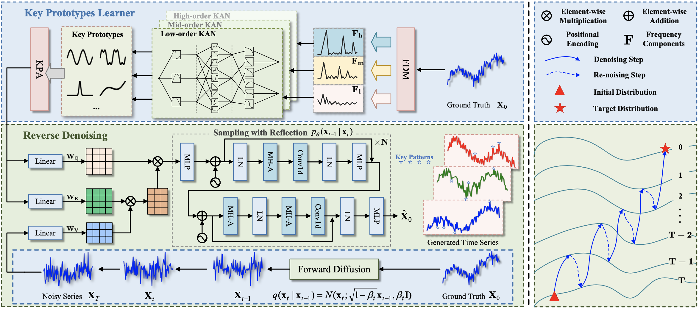

# K-ProtoDiff: Key Prototypes-Guided Diffusion for Time Series Generation
## Official Implementation
> 📄 **Paper**: *K-ProtoDiff: Key Prototypes-Guided Diffusion for Time Series Generation*  
> 🏆 **Accepted to**: AAAI 2026  

---

## 📌 Overview

**K-ProtoDiff** is a novel diffusion-based framework for high-fidelity **time series generation** that not only captures global temporal distributions but also preserves **localized key patterns** (e.g., abrupt changes, anomalies) critical for real-world decision-making.

#### By leveraging **adaptively learned key prototypes** and a novel **Reflection Sampling (R-Sampling)** strategy, K-ProtoDiff achieves state-of-the-art performance in both generation realism and structural fidelity.

#### Figure 1: Overall framework of K-ProtoDiff model. The framework generates time series conditioned on key prototypes extracted by the KPL module (top left). The forward diffusion transforms the original series into noise, while the reverse process performs R-sample (bottom right) to align the denoising trajectory with key prototypes, producing high-quality time series.*
---

## 🎯 Key Features

- **Key Prototypes Learner (KPL)**: Extracts representative temporal patterns via adaptive self-supervised learning.
- **Reflection Sampling (R-Sampling)**: A stepwise refinement strategy that aligns the reverse diffusion trajectory with key prototypes.
- **Multi-domain Evaluation**: Validated on **9 real-world datasets** across energy, traffic, healthcare, finance, and climate domains.
- **Superior Performance**: Achieves an average **77.6% improvement** in key pattern preservation over SOTA baselines.

---

## 📊 Results Highlights

| Metric          | Improvement |
|-----------------|-------------|
| C-FID Score     | Best on 8/9 datasets |
| KL Divergence   | Best on 4/9 datasets |
| Discriminative Score | Best on 8/9 datasets |
| Predictive Score    | Best on all datasets |
| Segment-wise DTW   | Best on majority of settings |

---
## 📈 Datasets
All datasets are publicly available for research use. 
## 🛠 Installation & Usage

### Requirements
- Python 3.8+
- PyTorch 1.12+
- NVIDIA GPU (tested on RTX 4090)

### Install Dependencies
```bash
pip install -r requirements.txt
```
### Run Training
```bash
python run.py --name $name --config_file ./Config/$name.yaml --gpu 3 --train
```
### Run Generation
```bash
python python run.py --name $name --config_file ./Config/$name.yaml --gpu 3 --sample 0
```
## 🧪 Evaluation
We provide evaluation scripts for:

* Context-FID

* KL Divergence

* Discriminative Score (DS)

* Predictive Score (PS)

* Segment-wise DTW

Run evaluation with:
```bash
python metric_pytorch.py --root "$root$cfg" \
--ori_path "$root/samples/${cfg}_norm_truth_24_train.npy" \
--fake_path "$root$name/ddpm_fake_${name}.npy"
```
