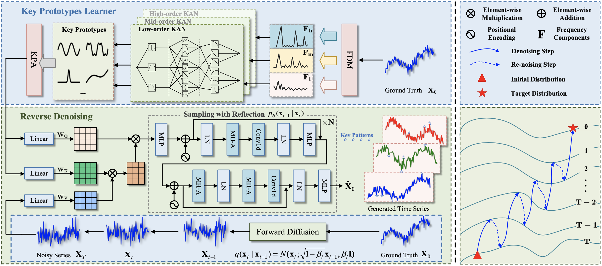

<div align="center">

# K-ProtoDiff
### Key Prototypes-Guided Diffusion for Time Series Generation

[](#)
[](#)
[](https://www.python.org/)
[](https://pytorch.org/)

**Official implementation of**
[*K-ProtoDiff: Key Prototypes-Guided Diffusion for Time Series Generation*](#) **(AAAI 2026)**

</div>

---

## 📌 Overview

**K-ProtoDiff** is a diffusion-based framework for high-fidelity **time series generation** that not only captures global temporal distributions but also preserves **localized key patterns** (e.g., abrupt changes, anomalies) that are critical for real-world decision-making.

By leveraging **adaptively learned key prototypes** together with a novel **Reflection Sampling (R-Sampling)** strategy, K-ProtoDiff achieves state-of-the-art performance in both generation realism and structural fidelity.

<p align="center">
  
  <br/>
  <em>Figure 1. Overall framework of K-ProtoDiff. The model generates time series conditioned on key prototypes extracted by the KPL module (top-left). The forward diffusion transforms the original series into noise, while the reverse process performs R-Sampling (bottom-right) to align the denoising trajectory with the key prototypes, producing high-quality time series.</em>
</p>

---

## 🎯 Key Features

- 🔑 **Key Prototypes Learner (KPL)** — extracts representative temporal patterns via adaptive self-supervised learning.
- 🔄 **Reflection Sampling (R-Sampling)** — a stepwise refinement strategy that aligns the reverse diffusion trajectory with key prototypes.
- 🌍 **Multi-domain Evaluation** — validated on **9 real-world datasets** spanning energy, traffic, healthcare, finance, and climate.
- 🏆 **Superior Performance** — average **77.6 %** improvement in key-pattern preservation over SOTA baselines.

---

## 📊 Results Highlights

| Metric                   | Result                          |
| ------------------------ | ------------------------------- |
| **Context-FID**          | Best on **8 / 9** datasets      |
| **KL Divergence**        | Best on **4 / 9** datasets      |
| **Discriminative Score** | Best on **8 / 9** datasets      |
| **Predictive Score**     | Best on **all** datasets        |
| **Segment-wise DTW**     | Best on majority of settings    |

---

## 📈 Datasets

All datasets used in this work are publicly available for research use.

---

## 🛠 Installation & Usage

### Requirements

- Python 3.8+
- PyTorch 1.12+
- NVIDIA GPU (tested on RTX 4090)

### Install Dependencies

```bash
pip install -r requirements.txt
```

### Training

```bash
python run.py --name $name --config_file ./Config/$name.yaml --gpu 3 --train
```

### Generation / Sampling

```bash
python run.py --name $name --config_file ./Config/$name.yaml --gpu 3 --sample 0
```

---

## 🧪 Evaluation

We provide evaluation scripts for the following metrics:

- **Context-FID (C-FID)**
- **KL Divergence**
- **Discriminative Score (DS)**
- **Predictive Score (PS)**
- **Segment-wise DTW**

Run evaluation with:

```bash
python metric_pytorch.py --root "$root$cfg" \
  --ori_path  "$root/samples/${cfg}_norm_truth_24_train.npy" \
  --fake_path "$root$name/ddpm_fake_${name}.npy"
```

---

## 🙏 Acknowledgments

Our codebase is built upon the excellent [**Diffusion-TS**](https://github.com/Y-debug-sys/Diffusion-TS) (ICLR 2024) repository. We sincerely thank the authors for open-sourcing their high-quality implementation, which provided a strong foundation for this work.

---

## 📚 Citation

If you find this work useful in your research, please consider citing:

```bibtex
@inproceedings{kprotodiff2026,
  title     = {K-ProtoDiff: Key Prototypes-Guided Diffusion for Time Series Generation},
  author    = {Author Names},
  booktitle = {Proceedings of the AAAI Conference on Artificial Intelligence},
  year      = {2026},
  url       = {#}
}
```
