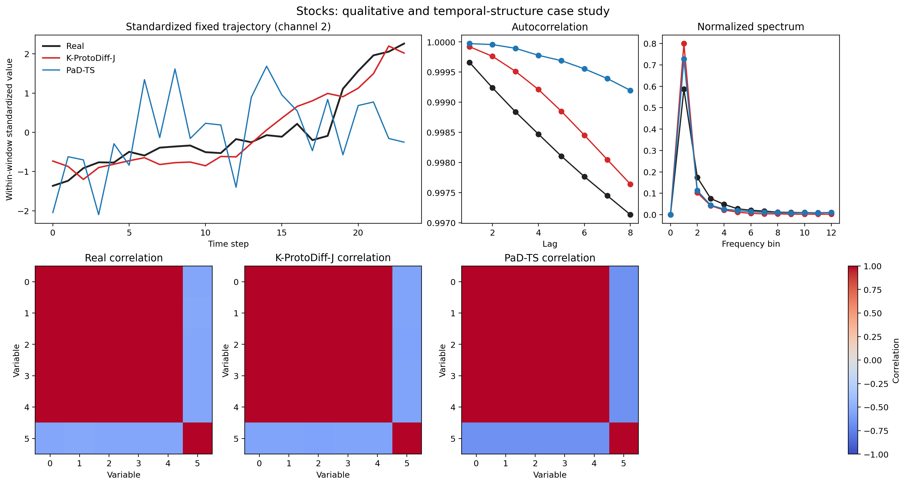
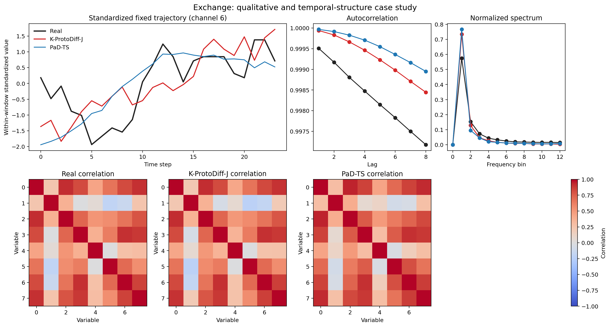
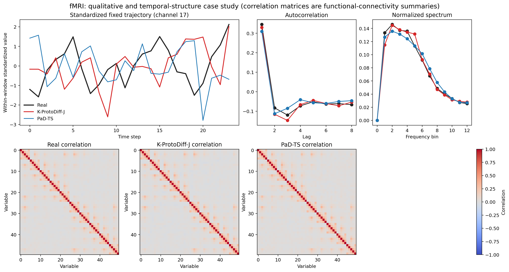

# Qualitative, temporal-structure, and downstream-utility results

> Frozen advantage-case analysis: Stocks, Exchange, and fMRI were selected before this analysis because K-ProtoDiff-J ranks first on the predictive score in the main table. These results are not presented as an all-dataset claim.

All values use three seeds and show mean ± sample standard deviation, rounded to three decimals. Lower is better. Best synthetic result is **bold** and second best is <u>underlined</u>.

## Result summary

K-ProtoDiff-J ranks first in 7 of 12 temporal-structure comparisons and second in the other 5. In the downstream experiment it ranks first in 3 of 6 comparisons and second in the other 3. The strongest structure results occur on Stocks and Exchange, while fMRI gives the clearest downstream result.

## Temporal-structure fidelity

Spectrum and local-trend distances are scaled by 100 for readability.

### Stocks

| Method | ACF | Spectrum ×100 | Correlation | Local trend ×100 |
|---|---:|---:|---:|---:|
| K-ProtoDiff-J | **0.005 ± 0.001** | <u>2.598 ± 0.338</u> | **0.006 ± 0.001** | **0.247 ± 0.019** |
| PaD-TS | 0.015 ± 0.002 | 2.669 ± 0.100 | 0.041 ± 0.005 | <u>0.252 ± 0.029</u> |
| TimeVAE | 0.048 ± 0.000 | **1.613 ± 0.237** | 0.072 ± 0.002 | 0.736 ± 0.006 |
| K-ProtoDiff | <u>0.006 ± 0.004</u> | 4.067 ± 0.229 | <u>0.019 ± 0.004</u> | 0.284 ± 0.039 |

Displayed channel: 2, selected solely by real-data variance.

### Exchange

| Method | ACF | Spectrum ×100 | Correlation | Local trend ×100 |
|---|---:|---:|---:|---:|
| K-ProtoDiff-J | **0.002 ± 0.000** | <u>2.252 ± 0.381</u> | **0.015 ± 0.004** | **0.299 ± 0.013** |
| PaD-TS | 0.003 ± 0.000 | 2.769 ± 0.119 | 0.047 ± 0.006 | 0.357 ± 0.005 |
| TimeVAE | 0.003 ± 0.000 | **1.335 ± 0.100** | <u>0.027 ± 0.005</u> | 0.458 ± 0.012 |
| K-ProtoDiff | <u>0.002 ± 0.000</u> | 3.465 ± 0.082 | 0.028 ± 0.005 | <u>0.330 ± 0.012</u> |

Displayed channel: 6, selected solely by real-data variance.

### fMRI

| Method | ACF | Spectrum ×100 | Correlation | Local trend ×100 |
|---|---:|---:|---:|---:|
| K-ProtoDiff-J | <u>0.015 ± 0.001</u> | <u>0.486 ± 0.014</u> | **0.009 ± 0.000** | <u>0.606 ± 0.013</u> |
| PaD-TS | **0.015 ± 0.000** | **0.472 ± 0.018** | <u>0.009 ± 0.001</u> | **0.179 ± 0.024** |
| TimeVAE | 0.228 ± 0.061 | 5.606 ± 0.240 | 0.188 ± 0.009 | 8.612 ± 0.051 |
| TimeGAN | 0.092 ± 0.016 | 2.497 ± 0.505 | 0.233 ± 0.044 | 0.943 ± 0.251 |

Displayed channel: 17, selected solely by real-data variance.

## Downstream one-step forecasting (item 5)

The predictor receives the first 23 time steps and predicts all variables at the final step. It is trained on real or generated windows and evaluated on five fixed, distributed real-data time blocks. Real training windows within 23 positions of a test block are purged to avoid overlap leakage.

| Dataset | Training source | MAE | RMSE |
|---|---|---:|---:|
| Stocks | Real training | 0.011 ± 0.001 | 0.031 ± 0.000 |
| Stocks | K-ProtoDiff-J | <u>0.012 ± 0.000</u> | **0.031 ± 0.001** |
| Stocks | PaD-TS | **0.011 ± 0.001** | <u>0.031 ± 0.000</u> |
| Stocks | TimeVAE | 0.019 ± 0.002 | 0.041 ± 0.003 |
| Stocks | K-ProtoDiff | 0.014 ± 0.001 | 0.033 ± 0.002 |
| Exchange | Real training | 0.007 ± 0.000 | 0.010 ± 0.001 |
| Exchange | K-ProtoDiff-J | <u>0.006 ± 0.000</u> | <u>0.009 ± 0.000</u> |
| Exchange | PaD-TS | **0.006 ± 0.000** | **0.009 ± 0.000** |
| Exchange | TimeVAE | 0.065 ± 0.099 | 0.078 ± 0.116 |
| Exchange | K-ProtoDiff | 0.009 ± 0.001 | 0.012 ± 0.001 |
| fMRI | Real training | 0.097 ± 0.000 | 0.123 ± 0.000 |
| fMRI | K-ProtoDiff-J | **0.097 ± 0.000** | **0.123 ± 0.000** |
| fMRI | PaD-TS | <u>0.098 ± 0.000</u> | <u>0.124 ± 0.000</u> |
| fMRI | TimeVAE | 0.101 ± 0.000 | 0.127 ± 0.000 |
| fMRI | TimeGAN | 0.128 ± 0.002 | 0.162 ± 0.003 |

Real training is a reference condition and is excluded from synthetic-method ranking.

## Interpretation boundary

The generators follow the paper's full-data generation protocol. The downstream table therefore measures utility under that protocol, not strict unseen-period generalization by the generator. Strict chronological forecasting would require retraining every generator only on the early partition.

Full protocol: [../protocols/QUALITATIVE_DOWNSTREAM_PROTOCOL.md](../protocols/QUALITATIVE_DOWNSTREAM_PROTOCOL.md)
